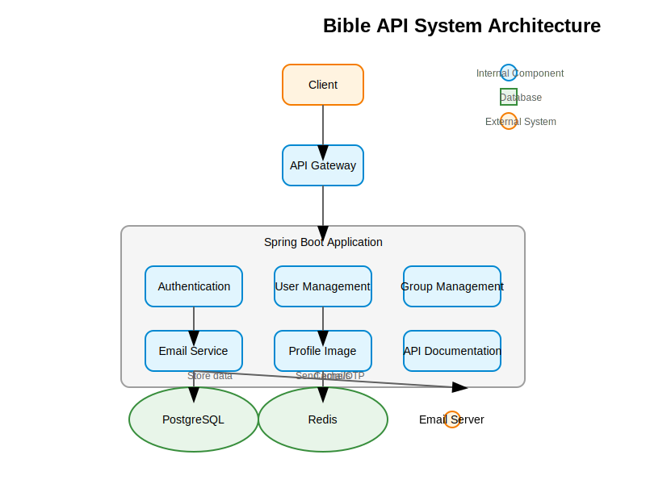
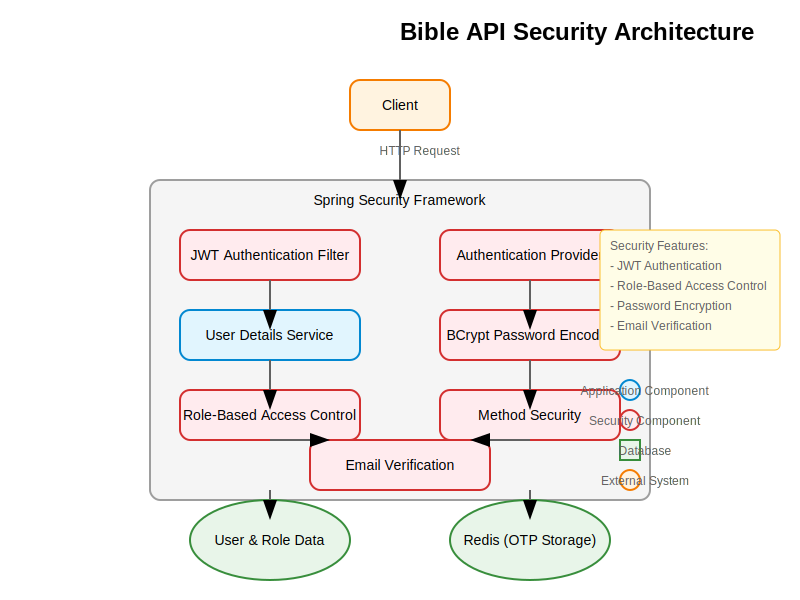
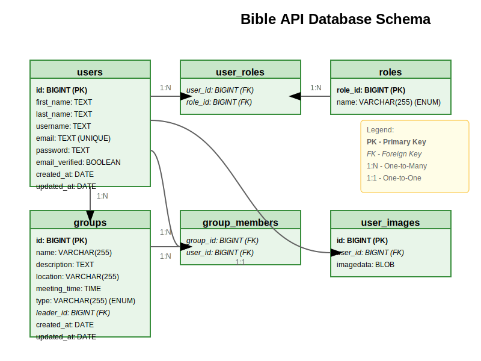

# Bible API

A comprehensive RESTful API for Bible study applications with advanced user management, group management, and robust security features.

## Overview

Bible API is a modern Spring Boot application designed to provide a secure and scalable backend for Bible study applications. It offers a complete set of features including user authentication, email verification, role-based access control, group management, and profile image handling. Built with Java 17 and Spring Boot 3, this API follows best practices for security, performance, and code organization.

## System Architecture

The Bible API follows a layered architecture pattern with clear separation of concerns:



The system consists of the following components:
- **Client Applications**: Web, mobile, or desktop applications that consume the API
- **API Gateway**: Entry point for all client requests
- **Spring Boot Application**: Core application with various modules:
  - Authentication Service: Handles user authentication and JWT token management
  - User Management: Manages user accounts, roles, and profile information
  - Group Management: Handles Bible study groups, memberships, and leadership
  - Email Service: Manages email verification and notifications
  - Profile Image Service: Handles user profile image upload and retrieval
  - API Documentation: Swagger/OpenAPI documentation
- **Databases**:
  - PostgreSQL: Primary database for storing application data
  - Redis: For caching and OTP management
- **External Services**:
  - Email Server: For sending verification emails and notifications

## Security Architecture

The API implements a comprehensive security model:



Key security features include:
- **JWT-based Authentication**: Secure, stateless authentication using JSON Web Tokens
- **Role-Based Access Control**: Three-tiered role system (Admin, Group Leader, Member)
- **Password Encryption**: BCrypt password hashing
- **Email Verification**: Required email verification for new accounts
- **Method-Level Security**: Fine-grained access control at the method level

## Technologies Used

- **Java 17**
- **Spring Boot 3.4.1**
  - Spring Boot Web
  - Spring Boot Data JPA
  - Spring Boot Security
  - Spring Boot Validation
  - Spring Boot Mail
  - Spring Boot Data Redis
- **JWT (JSON Web Token)** for authentication
- **Redis** for OTP management and caching
- **PostgreSQL** for production database
- **H2 Database** for development/testing
- **Lombok** for reducing boilerplate code
- **SpringDoc OpenAPI** for API documentation
- **Docker** for containerization
- **MailHog** for email testing

## Features

### User Management
- User registration with email verification
- Secure authentication with JWT
- Password encryption
- User profile management
- Profile image upload and retrieval
- Role-based access control (Admin, Group Leader, User)

### Group Management
- Create and manage Bible study groups
- Join or leave groups
- View group details (leader, members, location, time, etc.)
- Add or remove members from groups

### Security
- JWT-based authentication
- Role-based authorization
- Secure password handling
- Email verification for new accounts

### Email Services
- Email verification for new accounts
- Resend verification emails
- OTP (One-Time Password) management

## API Endpoints

### Authentication
- `POST /api/v1/auth/signup` - Register a new user
- `POST /api/v1/auth/signin` - Authenticate a user
- `POST /api/v1/auth/email/resend-verification` - Resend verification email
- `GET /api/v1/auth/email/verify` - Verify email with token

### User Management
- `GET /api/v1/users/check-username` - Check username availability
- `GET /api/v1/users/check-email` - Check email availability
- `GET /api/v1/users/getUser` - Get user information
- `PUT /api/v1/users/update/user/{username}` - Update user information
- `DELETE /api/v1/users/delete/user/{username}` - Delete a user (Admin only)
- `POST /api/v1/users/{username}/giveAdmin` - Grant admin privileges (Admin only)
- `DELETE /api/v1/users/{username}/removeAdmin` - Revoke admin privileges (Admin only)
- `POST /api/v1/users/{username}/give-group-leader` - Assign group leader role (Admin only)
- `DELETE /api/v1/users/{username}/remove-group-leader` - Remove group leader role (Admin only)

### Group Management
- `POST /api/v1/groups` - Create a new group (Leader or Admin only)
- `PUT /api/v1/groups/{groupId}` - Update a group (Leader or Admin only)
- `DELETE /api/v1/groups/{groupId}` - Delete a group (Leader or Admin only)
- `GET /api/v1/groups/{groupId}` - Get a group by ID
- `GET /api/v1/groups` - Get all groups
- `GET /api/v1/groups/leader` - Get groups led by the current user
- `GET /api/v1/groups/member` - Get groups the current user is a member of
- `POST /api/v1/groups/{groupId}/members` - Add a member to a group (Leader or Admin only)
- `DELETE /api/v1/groups/{groupId}/members` - Remove a member from a group
- `POST /api/v1/groups/{groupId}/join` - Join a group
- `POST /api/v1/groups/{groupId}/leave` - Leave a group

### Profile Image Management
- `POST /api/profile/upload/{username}` - Upload profile image
- `GET /api/profile/getProfile/{username}` - Get profile image information
- `GET /api/profile/image/{name}` - Get profile image by name

## Setup and Installation

### Prerequisites
- Java 17 or higher
- Docker and Docker Compose (optional, for Redis and MailHog)
- PostgreSQL (for production)

### Configuration
The application can be configured through the `application.properties` file:

```properties
# Application name and server configuration
spring.application.name=bibleApi
server.port=8005

# Database configuration
# For H2 (development)
spring.datasource.url=jdbc:h2:mem:testdb
spring.datasource.driverClassName=org.h2.Driver
spring.datasource.username=sa
spring.datasource.password=password
spring.jpa.database-platform=org.hibernate.dialect.H2Dialect

# For PostgreSQL (production)
# spring.datasource.url=jdbc:postgresql://localhost:5432/bibleapi
# spring.datasource.username=postgres
# spring.datasource.password=postgres
# spring.jpa.properties.hibernate.dialect=org.hibernate.dialect.PostgreSQLDialect

# JWT Configuration
brandyodhiambo.app.jwtSecret=your-secret-key
brandyodhiambo.app.jwtExpirationMs=86400000

# Email verification
email-verification.required=true

# Redis Configuration
spring.redis.host=localhost
spring.redis.port=6379
```

### Running with Docker
1. Clone the repository
2. Start Redis and MailHog using Docker Compose:
   ```bash
   docker-compose up -d
   ```
3. Build and run the application:
   ```bash
   ./gradlew bootRun
   ```

### Running without Docker
1. Clone the repository
2. Install and start Redis server
3. Configure email settings in application.properties
4. Build and run the application:
   ```bash
   ./gradlew bootRun
   ```

## Development

### Building the Project
```bash
./gradlew build
```

### Running Tests
```bash
./gradlew test
```

### API Documentation
Once the application is running, you can access the API documentation at:
```
http://localhost:8005/swagger-ui.html
```

## Database Schema

The database schema is visualized in the following Entity-Relationship Diagram (ERD):



The diagram shows the main entities and their relationships in the system:
- **Users**: Core entity storing user information
- **Roles**: Available roles in the system (Admin, Leader, Member)
- **Groups**: Bible study groups with their properties
- **User Images**: Profile images for users

### Tables

#### Users Table
| Column         | Type         | Constraints                |
|----------------|--------------|----------------------------|
| id             | BIGINT       | PK, AUTO_INCREMENT        |
| first_name     | TEXT         | NOT NULL                  |
| last_name      | TEXT         | NOT NULL                  |
| username       | TEXT         | NOT NULL                  |
| email          | TEXT         | NOT NULL, UNIQUE          |
| password       | TEXT         | NOT NULL                  |
| email_verified | BOOLEAN      | NOT NULL                  |
| created_at     | DATE         | NOT NULL                  |
| updated_at     | DATE         | NOT NULL                  |

#### Roles Table
| Column         | Type         | Constraints                |
|----------------|--------------|----------------------------|
| role_id        | BIGINT       | PK, AUTO_INCREMENT        |
| name           | VARCHAR(255) | NOT NULL, ENUM            |

#### User Roles Table (Join Table)
| Column         | Type         | Constraints                |
|----------------|--------------|----------------------------|
| user_id        | BIGINT       | FK -> users.id            |
| role_id        | BIGINT       | FK -> roles.role_id       |

#### Groups Table
| Column         | Type         | Constraints                |
|----------------|--------------|----------------------------|
| id             | BIGINT       | PK, AUTO_INCREMENT        |
| name           | VARCHAR(255) | NOT NULL                  |
| description    | TEXT         |                           |
| location       | VARCHAR(255) |                           |
| meeting_time   | TIME         |                           |
| type           | VARCHAR(255) | ENUM                      |
| leader_id      | BIGINT       | FK -> users.id, NOT NULL  |
| created_at     | DATE         | NOT NULL                  |
| updated_at     | DATE         | NOT NULL                  |

#### Group Members Table (Join Table)
| Column         | Type         | Constraints                |
|----------------|--------------|----------------------------|
| group_id       | BIGINT       | FK -> groups.id           |
| user_id        | BIGINT       | FK -> users.id            |

#### User Images Table
| Column         | Type         | Constraints                |
|----------------|--------------|----------------------------|
| id             | BIGINT       | PK, AUTO_INCREMENT        |
| user_id        | BIGINT       | FK -> users.id, NOT NULL  |
| imagedata      | BLOB         |                           |

### Entity Relationships

```
Users (1) <----> (0..1) UserImage  (One-to-One)
Users (N) <----> (M) Role          (Many-to-Many through user_roles)
Users (1) <----> (N) Group         (One-to-Many as leader)
Users (N) <----> (M) Group         (Many-to-Many through group_members)
```

#### Relationship Details:

1. **Users and Roles**:
   - A user can have multiple roles (ADMIN, LEADER, MEMBER)
   - A role can be assigned to multiple users
   - Implemented through the user_roles join table

2. **Users and UserImage**:
   - A user can have one profile image
   - A profile image belongs to one user
   - One-to-one relationship

3. **Users and Groups (as leader)**:
   - A user can lead multiple groups
   - A group has exactly one leader
   - One-to-many relationship

4. **Users and Groups (as member)**:
   - A user can be a member of multiple groups
   - A group can have multiple members
   - Many-to-many relationship through the group_members join table

## License
[MIT License](LICENSE)

## Contributing
Contributions are welcome! Please feel free to submit a Pull Request.

## Author
Brandy Odhiambo
